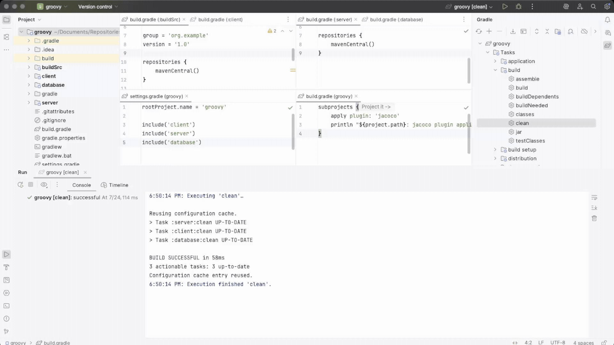
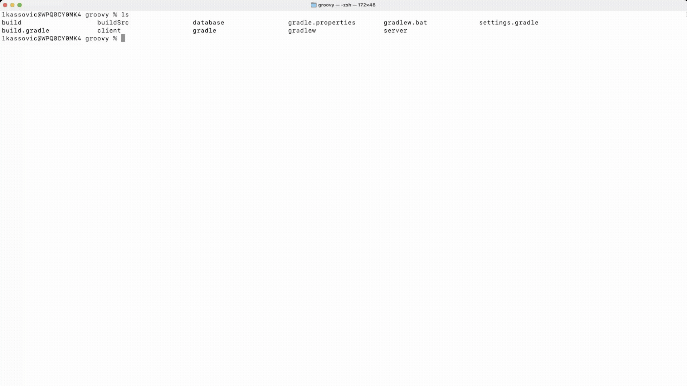

## 1.1. Partie 1 - Concepts de base

Gradle automatise la création, les tests et le déploiement de logiciels à partir des informations contenues dans les scripts de création.


### 1. Concepts de base

[Gradle Tutorial - Beginner Core Concepts](https://youtu.be/Vw39uWQ08Go)

Les builds Gradle sont définis en termes de projets et de tâches , configurés à l'aide de scripts de build écrits en Groovy ou Kotlin.

| Concept | Ce que cela signifie |
|:--------|:---------------------|
| Build (Construire) | Processus et environnement de production de résultats. Une build comprend un ou plusieurs projets et leurs scripts de build. |
| Project (Projet) | Un logiciel pouvant être construit, comme une application ou une bibliothèque. Une construction peut comporter un seul projet racine ou plusieurs sous-projets. |
| Task (Tâche) | Une unité de travail de base, comme la compilation de code ou l'exécution de tests. Les tâches sont déclarées dans des scripts de build ou ajoutées par des plugins. |
| Build Script (Script de construction) | Un fichier de configuration (`build.gradle(.kts)`) qui définit les tâches , les dépendances et d'autres instructions qui indiquent à Gradle comment créer un projet. |
| Plugin (Plugin) | Utilisé pour étendre les fonctionnalités de Gradle (comme le `Java` plugin). Les plugins ajoutent souvent des tâches et des conventions aux projets. |
| Dependency (Dépendance) | Ressources externes ou internes requises par un projet. Gradle les résout automatiquement lors de la construction. |

### 2. Structure du projet

De nombreux développeurs interagiront avec Gradle pour la première fois via un projet existant.

La présence des fichiers `gradlew` et `gradlew.bat` dans le répertoire racine d'un projet est un indicateur clair que Gradle est utilisé.

Un projet Gradle ressemblera à ce qui suit :

```
project
├── gradle                        (1)                        
├── gradlew                       (2)      
├── gradlew.bat                   (2)      
├── settings.gradle(.kts)         (3)  
├── subproject-a
│   ├── build.gradle(.kts)        (4)      
│   └── src/                      (5)  
└── subproject-b
    ├── build.gradle(.kts)        (4)      
    └── src/                      (5)  
```

* (1) Répertoire Gradle pour stocker les fichiers wrapper et plus
* (2) Scripts wrapper Gradle - CECI EST UN PROJET GRADLE !
* (3) Fichier de paramètres Gradle pour définir un nom de projet racine et des sous-projets
* (4) Scripts de build Gradle des deux sous-projets - subproject-aetsubproject-b
* (5) Code source et/ou fichiers supplémentaires pour les projets

### 3. Invocation de Gradle

#### 3.1. Dans l'IDE

Gradle est intégré à de nombreux IDE, notamment Android Studio, IntelliJ IDEA, Visual Studio Code, Eclipse et NetBeans.

Gradle peut être automatiquement invoqué lorsque vous créez, nettoyez ou exécutez votre application dans l'IDE.



Consultez le manuel de l'IDE de votre choix pour en savoir plus sur la manière dont Gradle peut être utilisé et configuré.

#### 3.2. Sur la ligne de commande

Gradle peut être invoqué en ligne de commande une fois installé :

```bash
$ gradle build
```
```bash
$ gradle test
```
```bash 
$ gradle clean build
```

La plupart des projets n'utilisent pas la version installée de Gradle mais plutôt le Gradle Wrapper.

#### 3.3. Avec le wrapper Gradle

Le wrapper est un script qui appelle une version déclarée de Gradle et constitue la méthode recommandée pour exécuter une build Gradle :



