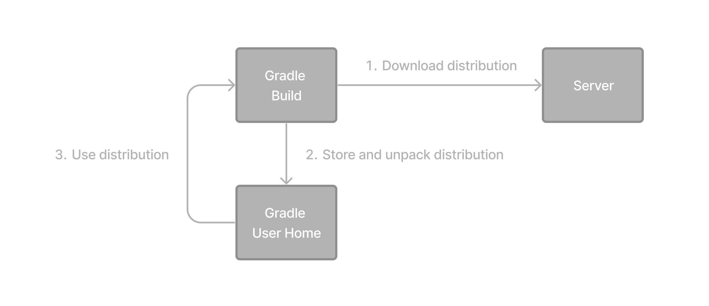

## 1.2. Partie 2 - Notions de base sur les wrappers

La méthode recommandée pour exécuter n'importe quelle build Gradle est d'utiliser Gradle Wrapper.


Le script wrapper appelle une version déclarée de Gradle, en la téléchargeant au préalable si nécessaire.



Il est disponible sous forme de fichier `gradlew` ou `gradlew.bat` dans le répertoire racine du projet :

```
root
├── gradlew     // THE WRAPPER FOR Linux / macOS
├── gradlew.bat // THE WRAPPER FOR Windows
└── ...
```

Si votre projet n’inclut pas ces fichiers, il ne s’agit probablement pas d’un projet Gradle ou le wrapper n’a pas encore été configuré.

**(i) Conseil**

Le wrapper ne se télécharge pas sur Internet. Vous devez le générer depuis `gradle wrapper` une machine sur laquelle Gradle est installé .

Le wrapper offre les avantages suivants :

* Télécharge et utilise automatiquement une version spécifique de Gradle.
* Standardise un projet sur une version Gradle donnée .
* Fournit la même version de Gradle pour différents utilisateurs et environnements (IDE, serveurs CI…).
* Facilite l' exécution des builds Gradle sans installer Gradle manuellement.

### 1. Utilisation du wrapper Gradle

Il est important de faire la distinction entre deux manières d'exécuter Gradle :

1. Utilisation d’une distribution Gradle installée sur le système — en exécutant la commande `gradle`.
2. Utilisation de Gradle Wrapper — en exécutant le script `gradlew` ou `gradlew.bat` inclus dans un projet Gradle.

Le Gradle Wrapper est toujours le moyen recommandé pour exécuter une build afin de garantir une exécution fiable, contrôlée et standardisée de la build.

1. Utilisation d'une distribution Gradle installée sur le système :

```bash
$ gradle build
``` 

2. Utilisation du wrapper Gradle :
   * Invocation du wrapper sur une machine Linux ou OSX :
        ```bash
        $ ./gradlew build
        ```
   * Appel du wrapper sur Windows PowerShell :
        ```bash
        $ gradlew.bat build
        ```

Si vous souhaitez exécuter la commande dans un répertoire différent, vous devez fournir le chemin relatif au wrapper :

```bash
$ ../gradlew build
```

La sortie de console suivante illustre l'utilisation du wrapper sur une machine Windows, dans l'invite de commande (cmd), pour un projet basé sur Java :

```bash
$ gradlew.bat build

Downloading https://services.gradle.org/distributions/gradle-5.0-all.zip
.....................................................................................
Unzipping C:\Documents and Settings\Claudia\.gradle\wrapper\dists\gradle-5.0-all\ac27o8rbd0ic8ih41or9l32mv\gradle-5.0-all.zip to C:\Documents and Settings\Claudia\.gradle\wrapper\dists\gradle-5.0-al\ac27o8rbd0ic8ih41or9l32mv
Set executable permissions for: C:\Documents and Settings\Claudia\.gradle\wrapper\dists\gradle-5.0-all\ac27o8rbd0ic8ih41or9l32mv\gradle-5.0\bin\gradle

BUILD SUCCESSFUL in 12s
1 actionable task: 1 executed
```

### 2. Comprendre les fichiers Wrapper

Les fichiers suivants font partie du Gradle Wrapper :

```
.
├── gradle
│   └── wrapper
│       ├── gradle-wrapper.jar          (1)
│       └── gradle-wrapper.properties   (2)
├── gradlew                             (3)
└── gradlew.bat                         (4)
```

* (1) `gradle-wrapper.jar` : Il s'agit d'un petit fichier JAR contenant le code du wrapper Gradle. Il permet de télécharger et d'installer la version de Gradle appropriée pour un projet, si elle n'est pas déjà installée.
* (2) `gradle-wrapper.properties` : Ce fichier contient les propriétés de configuration du Gradle Wrapper, telles que l'URL de distribution (où télécharger Gradle) et le type de distribution (ZIP ou TARBALL).
* (3) `gradlew` : Il s'agit d'un script shell (systèmes Unix) qui agit comme un wrapper autour de gradle-wrapper.jar. Il permet d'exécuter des tâches Gradle sur les systèmes Unix sans avoir à installer Gradle manuellement.
* (4) `gradlew.bat` : Il s'agit d'un script batch (Windows) qui sert le même objectif que Windows, gradlewmais qui est utilisé sur les systèmes Windows.

**(!) Important**

Vous ne devez jamais modifier ces fichiers.

Si vous souhaitez afficher ou mettre à jour la version Gradle de votre projet, utilisez la ligne de commande :

```bash
$ ./gradlew --version
$ ./gradlew wrapper --gradle-version 7.2
```

```bash
$ gradlew.bat --version
$ gradlew.bat wrapper --gradle-version 7.2
```

**/!\ Avertissement**

Ne modifiez pas les fichiers wrapper manuellement.